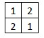
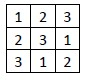
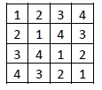
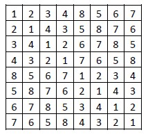
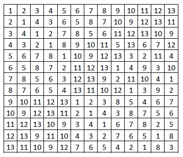

# Finding the latin square

* [Used technologies](#used-technologies)
* [Problem description](#problem-description)
* [How the algorithm works](#how-the-algorithm-works)
* [Results (with backtracking search)](#results-with-backtracking-search)

## Used technologies
* Python
* Numpy

## Problem description

There is a rectangular board of n x n fields. The problem requires filling the fields with n numbers (from 1 to n) in such a way that each column and row is filled
with all numbers.

## How the algorithm works

The program can use either backtracking search algorithm or search with forward checking heuristic.

## Results (with backtracking search)

Board size: 2x2 
Time elapsed: 0.0 
Result:

Board size: 3x3 
Time elapsed: 0.0 
Result:

Board size: 5x5 
Time elapsed: 0.0010023117065429688 
Result:

Board size: 8x8 
Time elapsed: 0.005012989044189453 
Result:

Board size: 13x13 
Time elapsed: 6.980597019195557 
Result:

